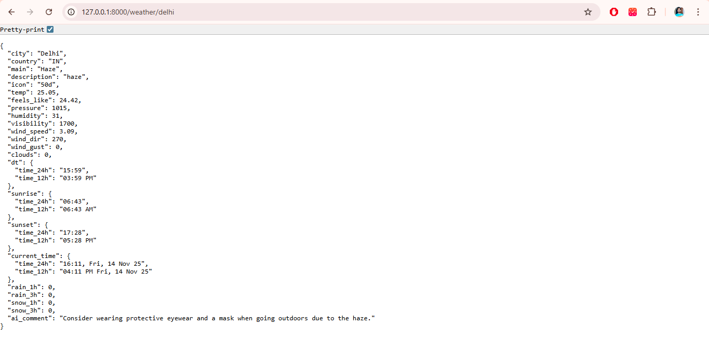
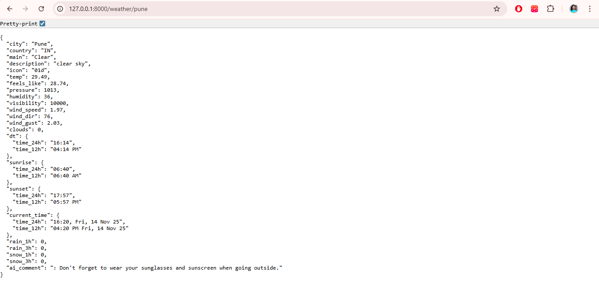
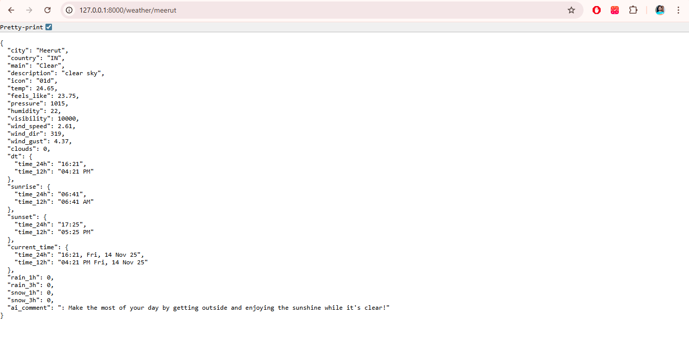
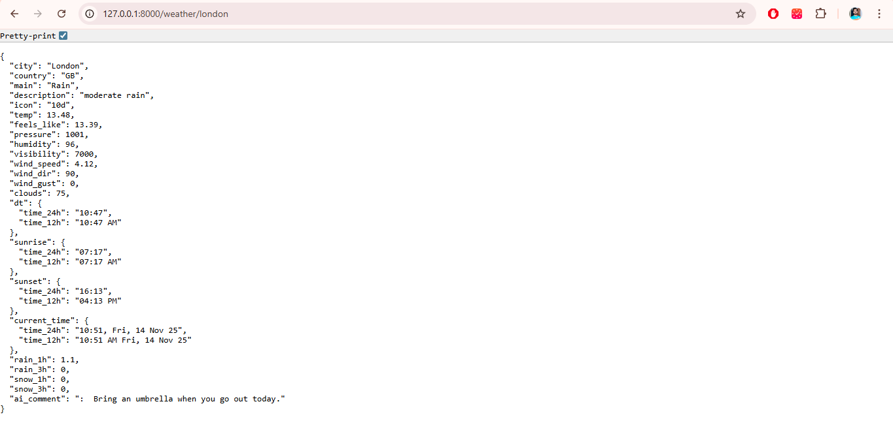

# Weather app

It is a project consisting of Python, HTML, tailwindCSS, JavaScript. It is built using fastapi and shows weather data using Open Weather API and gives uer a tip using Hugging Face API.

## ScreenShot

## Table of contents

- [Overview](#overview)
  - [The challenge](#the-challenge)
  - [Links](#links)
- [My process](#my-process)
  - [Built with](#built-with)
  - [API used](#api-used)
  - [What I learned](#what-i-learned)
- [Author](#author)
- [Edits](#edits)

## Overview

### The challenge

Make a proper weather app:

            - proper weather data
            - A search bar to search for any city
            - An AI tip for the user
            - Fully responsive layout (desktop & mobile)

### Links

- Solution URL: [Github](https://github.com/VikashUpadhyay442/weather_app)
<!-- - Live Site URL: [Github pages](https://vikashupadhyay442.github.io/Interactive_Gallery/) -->

## My process

### Built with

- Python
- FastAPI
- HTML5
- TailwindCSS
- Flexbox
- Grid
- Vanilla JavaScript
- Mobile-first workflow

### API Used

I have used two API in this project which are:
1. Open Weather API
2. Hugging Face API

### What I learned

I learned:
1. Usage of requests for API.
2. Usage of FastAPI.
3. Integration of AI in the project
4. How to raise HTTP exeption
5. How to use Date and time in python

## Author

- Github - [Vikash Upadhyay](https://github.com/VikashUpadhyay442)

## Edits
